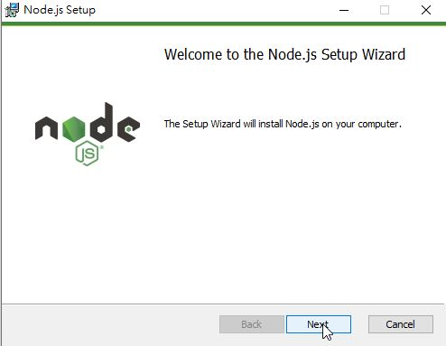
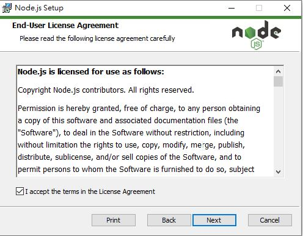
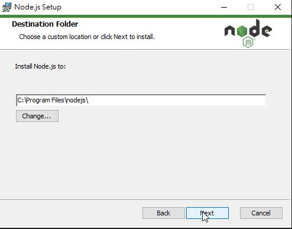
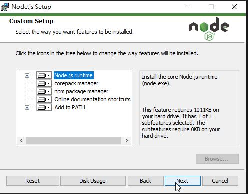
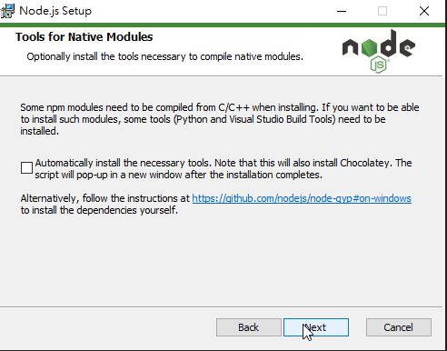
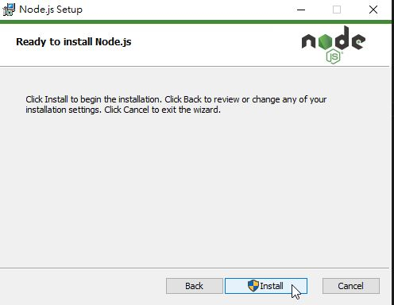

# Windows 安裝方法
1. 下載 [node.js 16.14.0LTS](https://nodejs.org/en/)  
2. 安裝 node.js  
  *  點選Next  
  
  *  同意後Next    
  
  *  點選Next    
  
  *  點選Next    
  
  *  點選Next    
  
  *  點選Install    
  
3. 打開命提示字元(WIN + R 輸入 cmd)
  * 從git抓取整份靜態網頁code
  ```bash=
  git clone https://git.twcc.ai/twcc/manual
  ```  
  * 切換進manual資料夾
  ```bash=
  cd manual
  ```  
  * 切換至heckout 189-docusaurus分支
  ```bash=
  git checkout 189-docusaurus
  ```  
  * 安裝套件
  ```bash=
  npm install
  ```  
  * 啟動系統
  ```bash=
  npx docusaurus start --host 0.0.0.0 --port 8000
  ```   

